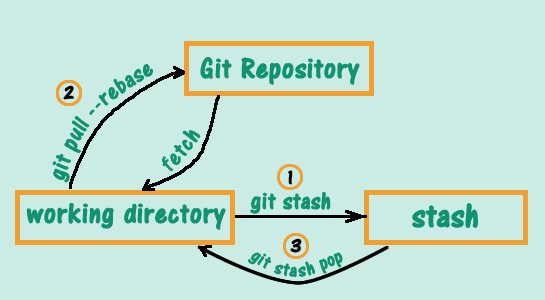
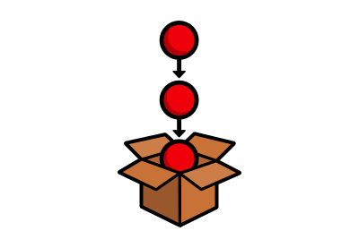
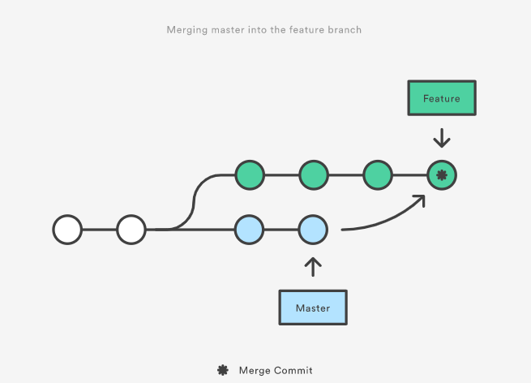
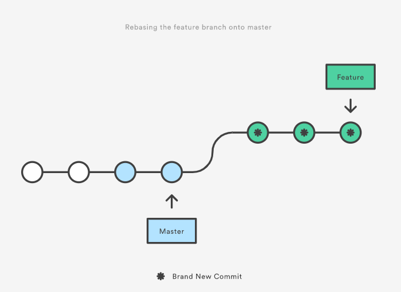
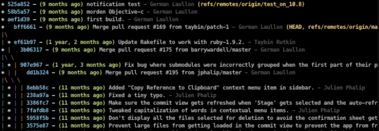
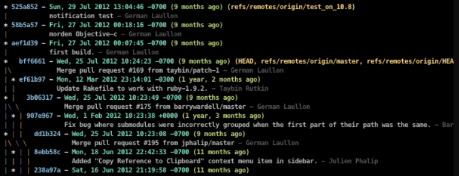
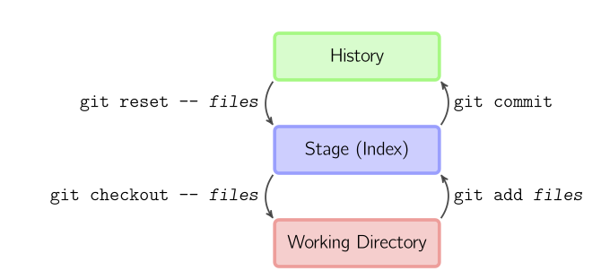
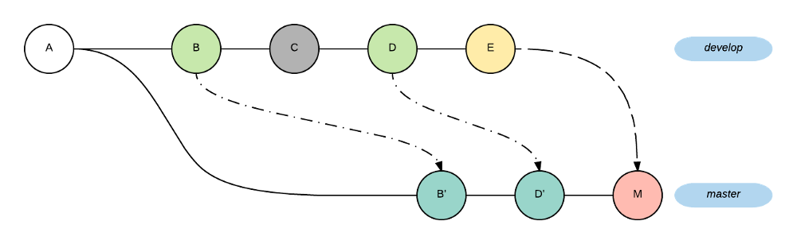
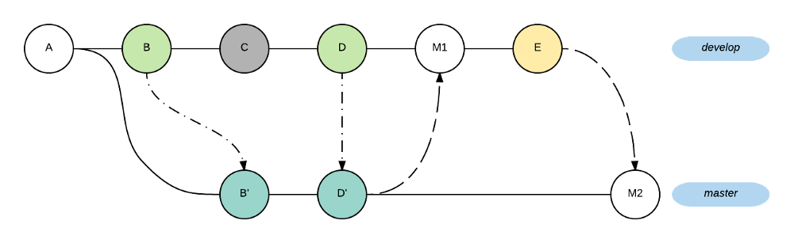

# Git - Guide

## What's Git?

> Git is a free and open source distributed version control system (SCM)
> designed to handle everything from small to very large projects with
> speed and efficiency.  (See more [About
> Git](https://git-scm.com/about/free-and-open-source))

Git was created by Linus Torvalds in 2005 for development of the Linux kernel, with other kernel developers contributing to its initial development. (See [A short history of Git](https://git-scm.com/book/en/v2/Getting-Started-A-Short-History-of-Git))

## Table of contents

1. [Download](#download)
2. [Configuration](#configuration)
    2.1. [User credentials](#user_credentials)
    2.2. [Credentials helpers](#credentials_helpers)
    2.3. [Text editors](#text_editors)
    2.4. [Aliases](#aliases)
3. [Getting started](#getting_started)
    3.1. [Create a new repository](#new_repository)
    3.2. [Checkout a repository](#checkout_repository)
    3.3. [Remote & Upstream](#remote_upstream)
    3.4. [Workflow](#workflow)
    3.5. [Add & Commit](#add_commit)
    3.6. [Pushing changes](#pushing_changes)
    3.7. [Branching](#branching)
    3.8. [Stash](#stash)
    3.9. [Update & Merge](#update_merge)
    3.10. [Rebase & Squash](#rebase_squash)
    3.11. [Tagging](#tagging)
    3.12. [Log](#log)
    3.13. [Reflog](#reflog)
    3.14 [Reset](#reset)
4. [Git Flow](#git_flow)
    4.1. [Feature](#feature)
    4.2. [Release](#release)
    4.3. [Hotfix](#hotfix)
    4.4. [Git Flow vs Git](#git_flow_vs_git)
5. [Cherry-pick](#cherry_pick)
6. [Tools](#tools)
    6.1. [Gitk](#gitk)
    6.2. [Diff/Merge tools](#diff_merge_tools)
7. [References](#references)

<div id='download'/>

## 1. Download

[Git for Windows](https://git-scm.com/download/win)
[Git for Linux](https://git-scm.com/download/linux)

You can check your installed git version like this:

    $ git version

<div id='configuration'/>

# 2. Configuration

 To use [git config](https://git-scm.com/docs/git-init) to get and set repository or global options:
 
    $ git config --list


<div id='user_credentials'/>

### 2.1. User credentials


    $ git config --global user.name "username"
    $ git config --global user.email username@host
    
<div id='credentials_helpers'/>

### 2.2. Credentials helpers

You can just use one of the following credential helpers:

**Cache**

Tells Git to keep your password cached in memory for (by default) 15 minutes. **The cache is accessible over a Unix domain socket, restricted to the current user by filesystem permissions.

    $ git config --global credential.helper cache

 You can set a longer timeout with:

    $ git config --global credential.helper "cache --timeout=3600"

**Store**

Tells Git to keep  your passwords _unencrypted_ on disk, protected only by filesystem permissions.

    $ git config --global credential.helper "store --file ~/.gitcredential"

**Windows**

For Windows, there is a helper called [Git Credential Manager for Windows](https://github.com/Microsoft/Git-Credential-Manager-for-Windows)

    $ git config --global credential.helper manager

**Linux**
For Linux, you can use [gnome-keyring](https://stackoverflow.com/questions/13385690/how-to-use-git-with-gnome-keyring-integration) (or other keyring implementation such as KWallet).

    $ sudo apt-get install libsecret-1-0 libsecret-1-dev
    cd /usr/share/doc/git/contrib/credential/libsecret
    $ sudo make
    $ git config --global credential.helper /usr/share/doc/git/contrib/credential/libsecret/git-credential-libsecret

<div id='text_editors'/>

###  2.3. Associating text editors

**Atom**

    $ git config --global core.editor "atom --wait"

**Sublime Text**

    $ git config --global core.editor "'C:\Program Files\Sublime Text 3\sublime_text.exe' -w"
  
**VsCode**

    $ git config --global core.editor "code --wait"

**Notepad++**

    $ git config --global core.editor "'C:\Program Files\Notepad++\notepad++.exe' -multiInst -notabbar -nosession -noPlugin"
     
**Nano**

    $ git config --global core.editor "nano -w"

**Vim**

    $ git config --global core.editor "vim"

<div id='aliases'/>  

### 2.4. Aliases 

    $ git config --global alias.co checkout
    $ git config --global alias.br branch
    $ git config --global alias.ci commit
    $ git config --global alias.st status

<div id='getting_started'/>

## 3. Getting started

<div id='new_repository'/>

### 3.1. Create a new repository

To initialize a git repository in the root of the folder, run the [git init](http://git-scm.com/docs/git-init) command:

    $ mkdir myproject
    $ cd myproject/
    $ git init

<div id='checkout_repository'/>

###  3.2. Checkout a repository

Create a working copy of a local repository by running the command:

    $ git clone /path/to/repository

when using a remote server, your command will be:  

    $ git clone username@host:/path/to/repository

<div id='remote_upstream'/>

### 3.3. Add Remote & Upstream

You can use [git remote](https://git-scm.com/docs/git-remote) to manage set of tracked repositories

<div>
    
</div>
List the current configured remote repository:

    $ git remote -v

**Configure a remote for your own repository**
If you have not cloned an existing repository and want to connect your repository to a remote server, you need to add it with:

    $ git remote add origin https://github.com/YOUR_USERNAME/YOUR_REPO.git
  
Now you are able to push your changes to the selected remote server. Git will create two url(fetch and push), so when using *git remote -v*, the output should show something like this:

    > origin  https://github.com/YOUR_USERNAME/YOUR_REPO.git (fetch)
    > origin  https://github.com/YOUR_USERNAME/YOUR_REPO.git (push)

**Configure a remote for a fork repository**

    git remote add upstream https://github.com/ORIGINAL_OWNER/ORIGINAL_REPOSITORY.git
(See more about [Fork a repository](https://help.github.com/en/articles/fork-a-repo))

<div id='workflow'/>

### 3.4. Workflow

Your local repository consists of three "trees" maintained by git. The first one is your `Working Directory` which holds the actual files. the second one is the `Index` which acts as a staging area and finally the `HEAD` which points to the last commit you've made.

<div>
    
</div>


You can use  [git status ](https://git-scm.com/docs/git-status) to show the working tree status.

    $ git status

<div id='add_commit'/>

### 3.5. Add & Commit

You can propose changes (add it to the **Index**) using:

| Command              | Result                        |
|----------------------|-------------------------------|
|`$ git add <filename>`| Stages a file|
|`$ git add -A`        | Stages all changes   |
|`$ git add .`         | Stages new files and modifications, without deletions      |
|`$ git add -u`        | Stages modifications and deletions, without new files|

This is the first step in the basic git workflow. To actually commit these changes use [git commit](https://git-scm.com/docs/git-commit):

| Command              | Result                        |
|----------------------|-------------------------------|
|`$  git commit -m "commit message"`| Commit with message|
|`$  git commit -m "commit message" -m "Commit description"`        | Commit with message and description   |
|`$  git commit --amend -m "commit message"`| Replace the last commit creating a new commit|


> **Note:** You can also use `git commit -a` for stage files that have been modified and deleted, but new files you have not told Git about are not affected:
 >   `$ git commit -am "Commit message"`
 >  
Now the file is committed to the **HEAD**, but not in your remote repository yet.

<div id='pushing_changes'/>

### 3.6. Pushing changes

Your changes are now in the **HEAD** of your local working copy. To send those changes to your remote repository, execute:  

     $ git push origin master

You can also manually **delete** the remote branch using:

    $ git push origin --delete master

> **Note:**  Change _master_ to whatever branch you want to push your changes to.

<div id='branching'/>

### 3.7. Branching

Branches are used to develop features isolated from each other. The ***master*** branch is the "default" branch when you create a repository. Use other branches for development and merge them back to the master branch upon completion.

<div>
    
</div>


| Command              | Result                        |
|----------------------|-------------------------------|
|`$ git branch mybranch`| Create a new branch named "mybranch"|
|`$ git checkout mybranch`| Switch back to branch "mybranch"|
|`$ git checkout -b mybranch`| Create a new branch named "mybranch" and switch to it|
|`$ git branch -d mybranch`| Delete the branch "mybranch"|

<div id='stash'/>

### 3.8. Stash

You can use [git stash ](https://git-scm.com/docs/git-stash) to stash the changes in a dirty working directory away.

    $ git stash

<div>
    
    
</div>

Git stash temporarily shelves (or _stashes_) changes you've made to your working copy so you can work on something else, and then come back and re-apply them later on.

>**Note:** You aren't limited to a single stash. You can run `git stash` several times to create multiple stashes.

| Command              | Result                        |
|----------------------|-------------------------------|
|`$ git stash list`|Lists all stashes|
|`$ git stash save "message"`|Annotates your stashes with a description|
|`$ git stash pop`|Removes the last change from your stash and reapplies it to your working copy.|
|`$ git stash apply`| Reapply the last change to your working copy and keep it in your stash|
|`$ git stash drop`| Delete the last stash|
|`$ git stash drop stash@{2}`| Delete by passing its identifier as the last argument|
|`$ git stash clear`| Delete all of your stashes|
|`$ git stash pop stash@{2}`| Re-apply by passing its identifier as the last argument|
|`$ git stash branch mybranch stash@{1}`| Creates a branch "mybranch" from your stash|
|`$ git stash show`           | Shows a summary of a stash|
|`$ git stash show mystash`   | Shows the changes recorded in "mystash"|
|`$ git stash show -p`| Shows the full diff of a stash|


<div id='update_merge'/>

### 3.9. Update & Merge

To download all objects and refs from repository use [git fetch](https://git-scm.com/docs/git-fetch) :

    $ git fetch
    
 To merge another branch into your active branch (e.g. master), use [git merge](https://git-scm.com/docs/git-merge):

    $ git merge mybranch
    
To update your local repository to the newest commit, execute in your working directory to  fetch and merge remote changes (**`git fetch`** + **`git merge`**), use [git pull](https://git-scm.com/docs/git-pull):

    $ git pull

>**Note**: Unfortunately, this is not always possible and results in _conflicts_. You are responsible to merge those _conflicts_ manually by editing the files shown by git. After changing, you need to mark them as merged with  
`git add <filename>`  
before merging changes, you can also preview them by using  
`git diff <source_branch> <target_branch>`

| Command              | Result                        |
|----------------------|-------------------------------|
|`$ git pull origin mybranch`|Fetch and merge remote changes of mybranch|
|`$ git pull --rebase`|Rebases your local commits ontop of remote HEAD and does _not_ create a merge/merge commit (**`git fetch`** + **`git rebase`**)|
|`$ git merge mybranch --no-ff`| Merge branch and create a merge commit|

<div id='rebase_squash'/>

### 3.10. Rebase & Squash


[git rebase ](https://git-scm.com/docs/git-rebase) allows to reapply commits on top of another base tip.

**Rebasing**

In Git, there are two main ways to integrate changes from one branch into another: the  `merge`  and the  `rebase`.


<div>
    
</div>


    $ git checkout feature
    $ git rebase master


<div>
    
</div>


(See more about [Git Rebasing](https://git-scm.com/book/en/v2/Git-Branching-Rebasing))


**Rewriting History**
To modify a commit that is farther back in your history, you must move to more complex tools. Git doesn’t have a modify-history tool, but you can use the rebase tool to rebase a series of commits onto the HEAD they were originally based on instead of moving them to another one. You can run rebase interactively by adding the `-i` option to `git rebase`. You must indicate how far back you want to rewrite commits by telling the command which commit to rebase onto.

    $ git rebase -i HEAD~#

The script puts helpful instructions in the rebase message:

```console
#
# Commands:
# p, pick <commit> = use commit
# r, reword <commit> = use commit, but edit the commit message
# e, edit <commit> = use commit, but stop for amending
# s, squash <commit> = use commit, but meld into previous commit
# f, fixup <commit> = like "squash", but discard this commit's log message
# x, exec <command> = run command (the rest of the line) using shell
# b, break = stop here (continue rebase later with 'git rebase --continue')
# d, drop <commit> = remove commit
# l, label <label> = label current HEAD with a name
# t, reset <label> = reset HEAD to a label
# m, merge [-C <commit> | -c <commit>] <label> [# <oneline>]
# .       create a merge commit using the original merge commit's
# .       message (or the oneline, if no original merge commit was
# .       specified). Use -c <commit> to reword the commit message.
#
# These lines can be re-ordered; they are executed from top to bottom.
#
# If you remove a line here THAT COMMIT WILL BE LOST.
#
# However, if you remove everything, the rebase will be aborted.
#
# Note that empty commits are commented out
```


**Squashing Commits**
It’s also possible to take a series of commits and squash them down into a single commit with the interactive rebasing tool. For example:

    $ git rebase -i HEAD~3

If, instead of “pick” or “edit”, you specify “squash”, Git applies both that change and the change directly before it and makes you merge the commit messages together. So, if you want to make a single commit from these three commits, you make the script look like this:

```console
pick f7f3f6d changed my name a bit
squash 310154e updated README formatting and added blame
squash a5f4a0d added cat-file
```

When you save and exit the editor, Git applies all three changes and then puts you back into the editor to merge the three commit messages:

```console
# This is a combination of 3 commits.
# The first commit's message is:
changed my name a bit

# This is the 2nd commit message:

updated README formatting and added blame

# This is the 3rd commit message:

added cat-file
```

When you save that, you have a single commit that introduces the changes of all three previous commits.

In case of conflict,  _git rebase_  will stop at the first problematic commit and leave conflict markers in the tree. You can use  _git diff_  to locate the markers (<<<<<<) and make edits to resolve the conflict. **For each file you edit, you need to tell Git that the conflict has been resolved**, typically this would be done with

    $ git add <filename>

After resolving the conflict manually and updating the index with the desired resolution, you can **continue the rebasing** process with

    $ git rebase --continue

Alternatively, you can **undo the  _git rebase_**  with

    $ git rebase --abort

>**Note:** It's also possible to reword, edit and drop commits. (See more about[ Git tools rewriting history](https://git-scm.com/book/en/v2/Git-Tools-Rewriting-History))

<div id='tagging'/>

### 3.11. Tagging


It's recommended to create tags for software releases. This is a known concept, which also exists in SVN. You can create a new tag named 1.0.0 by executing [git tag](https://git-scm.com/docs/git-tag):

    $ git tab 1.0.0 

You can also use:
  
    $ git tab 1.0.0 1b2e1d63ff

The _1b2e1d63ff_ stands for the first 10 characters of the commit id you want to reference with your tag.

<div id='log'/>

### 3.12. Log

You can study repository history using [git log](https://git-scm.com/docs/git-log):

    $  git log

You can add a lot of parameters to make the log look like what you want:

| Command              | Result                        |
|----------------------|-------------------------------|
|`$ git log --author=bob`|To see only the commits of a certain author|
|`$ git log --pretty=oneline`|To see a very compressed log where each commit is one line|
|`$ git log --graph --oneline --decorate --all`|To see an ASCII art tree of all the branches, decorated with the names of tags and branches|
|`$ git log --author=bob`|To see only the commits of a certain author|
|`$ git log --name-status`|To see only which files have changed|

To make life easier, you can can add a `git alias` so you don't have to remember the entire syntax:

**lg1**

<div>
    
</div>

     $ git config --global alias.lg1 "log --graph --abbrev-commit --decorate --format=format:'%C(bold blue)%h%C(reset) - %C(bold green)(%ar)%C(reset) %C(white)%s%C(reset) %C(dim white)- %an%C(reset)%C(bold yellow)%d%C(reset)' --all"

**lg2**

<div>
    
</div>

     $ git config --global alias.lg2 "log --graph --abbrev-commit --decorate --format=format:'%C(bold blue)%h%C(reset) - %C(bold cyan)%aD%C(reset) %C(bold green)(%ar)%C(reset)%C(bold yellow)%d%C(reset)%n''          %C(white)%s%C(reset) %C(dim white)- %an%C(reset)' --all"
(See more about [Pretty git branch graphs](https://stackoverflow.com/questions/1057564/pretty-git-branch-graphs))

<div id='reflog'/>

### 3.13. Reflog

With the git reflog command you can review where it has been at any time past:

    $ git reflog
    > 1a410ef HEAD@{0}: 1a410efbd13591db07496601ebc7a059dd55cfe9: updating HEAD 
    > ab1afef HEAD@{1}: ab1afef80fac8e34258ff41fc1b867c702daa24b: updating HEAD
So you can do checkout:

    $ git checkout HEAD@{...}

<div id='reset'/>

### 3.14. Reset

You can use [git reset](https://git-scm.com/docs/git-reset)  to reset current HEAD to the specified state.
	
	$ git reset [--<mode>] [<commit>]
	$ git reset [--<mode>] [HEAD^#]
	
	# <mode> : mixed(default), soft, hard


<div>
    
</div>


**Git Checkout vs Git Reset**

`$ git checkout .` or `$ git checkout -- files` will only update the working tree, that is changes which have not yet been staged using git add.
<div>
    
</div>


<div id='git_flow'/>

## 4. Git-flow

[git-flow](https://danielkummer.github.io/git-flow-cheatsheet/) are a set of git extensions to provide high-level repository operations for Vincent Driessen's branching model (see [more](https://nvie.com/posts/a-successful-git-branching-model/)).

Git includes git-flow from version 2.5.4. You can check your installed git-flow version like this:

    $ git flow version

<div id='feature'/>

### 4.1. Feature

| Command              | Result                        |
|----------------------|-------------------------------|
|`$ git flow feature start MYFEATURE`|Create a feature branch|
|`$ git flow feature publish MYFEATURE`|Share a feature branch|
|`$ git flow feature pull origin MYFEATURE`|Get latest for a feature branch|
|`$ git flow feature finish MYFEATURE`|Finalize a feature branch|

<div id='release'/>

### 4.2. Release

| Command              | Result                        |
|----------------------|-------------------------------|
|`$ git flow release start 1.2.0`|Create a release branch|
|`$ git flow release publish 1.2.0`|Share a release branch|
|`$ git flow release finish 1.2.0`|Finalize a release branch|

<div id='hotfix'/>

### 4.3. Hotfix

| Command              | Result                        |
|----------------------|-------------------------------|
|`$ git flow hotfix start 1.2.1 [commit]`|Create a hotfix branch|
|`$git flow hotfix finish 1.2.1`|Finalize a hotfix branch|

<div id='workflow'/>

### 4.4. Git-flow vs Git

[A comparison of using `git flow` commands versus raw `git` commands.](https://gist.github.com/JamesMGreene/cdd0ac49f90c987e45ac)
<div id='workflow'/>

<div id='cherry_pick'/>

## 5. Cherry-pick

You can use [git cherry-pick](https://git-scm.com/docs/git-cherry-pick) to apply the changes introduced by some existing commits.

	$ git cherry-pick commitSha
	
In case of conflict, you can continue the operation **after resolving them** using:
 
    $ git cherry-pick --continue
    
or **cancel** the operation and return to the pre-sequence state using

    $ git cherry-pick --abort

Cherry picking is commonly discouraged in the developer community. The main reason is that it creates duplicate commits and you lose the ability to track the commit history.

<div>
    
</div>

<div>
    
</div>

> "If you cherry pick, your branch model is wrong" (see [more](http://www.draconianoverlord.com/2013/09/07/no-cherry-picking.html))


<div id='tools'/>

## 6. Tools


<div id='gitk'/>

### 6.1. Gitk


<div id='diff_merge_tools'/>

### 6.2. Diff/Merge tools

## 7. References

[https://rogerdudler.github.io/git-guide/](https://rogerdudler.github.io/git-guide/)

